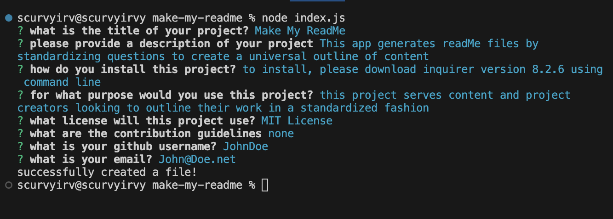

# Make My ReadMe

## Description

Make My ReadMe generates ReadMe files through a streamlined set of questions. This efficient, yet personalized format allows you to create ReadMe files with ease!

## Table of Contents

- utils
    - generateMarkdown.js
    - images folder
- gitignore
- LICENSE
- index.js
- package-lock.json
- package.json
- README.md file

## Tasks 

- WHEN I enter VS Code, THEN I see a list of files on the left hand side
- WHEN I open the integrated terminal for the Make My ReadMe folder, THEN I install inquirer version 8.2.6
- WHEN I enter into the command line 'node index.js' THEN I am met with questions regarding user input to generate a ReadMe file
- WHEN I finish entering user input data, THEN I generate a 'newReadMe.md' file on the left side

## Usage

## Links

- Deployed Webpage: https://scurvyirv.github.io/make-my-readme/
- GitHub Repo Page: https://github.com/scurvyirv/make-my-readme.git

## Credits

- https://opensource.org/license
- https://www.npmjs.com/package/inquirer/v/8.2.6

## License

MIT License

Copyright (c) 2024 scurvyirv

Permission is hereby granted, free of charge, to any person obtaining a copy of this software and associated documentation files (the "Software"), to deal in the Software without restriction, including without limitation the rights to use, copy, modify, merge, publish, distribute, sublicense, and/or sell copies of the Software, and to permit persons to whom the Software is furnished to do so, subject to the following conditions:

The above copyright notice and this permission notice shall be included in all copies or substantial portions of the Software.

THE SOFTWARE IS PROVIDED "AS IS", WITHOUT WARRANTY OF ANY KIND, EXPRESS OR IMPLIED, INCLUDING BUT NOT LIMITED TO THE WARRANTIES OF MERCHANTABILITY, FITNESS FOR A PARTICULAR PURPOSE AND NONINFRINGEMENT. IN NO EVENT SHALL THE AUTHORS OR COPYRIGHT HOLDERS BE LIABLE FOR ANY CLAIM, DAMAGES OR OTHER LIABILITY, WHETHER IN AN ACTION OF CONTRACT, TORT OR OTHERWISE, ARISING FROM, OUT OF OR IN CONNECTION WITH THE SOFTWARE OR THE USE OR OTHER DEALINGS IN THE SOFTWARE.